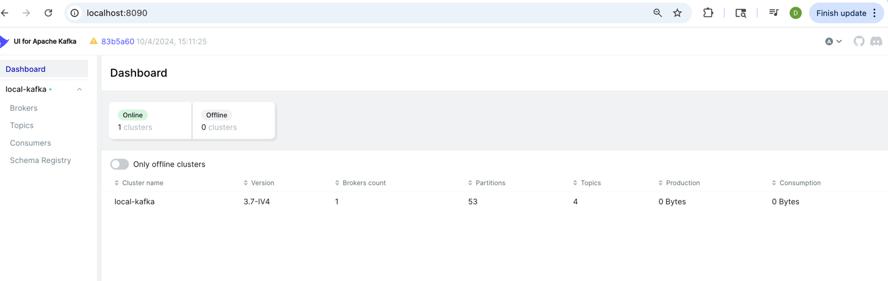
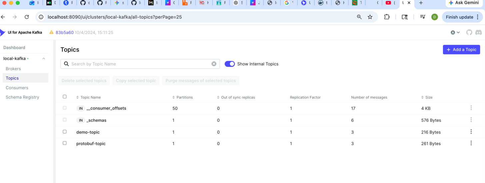
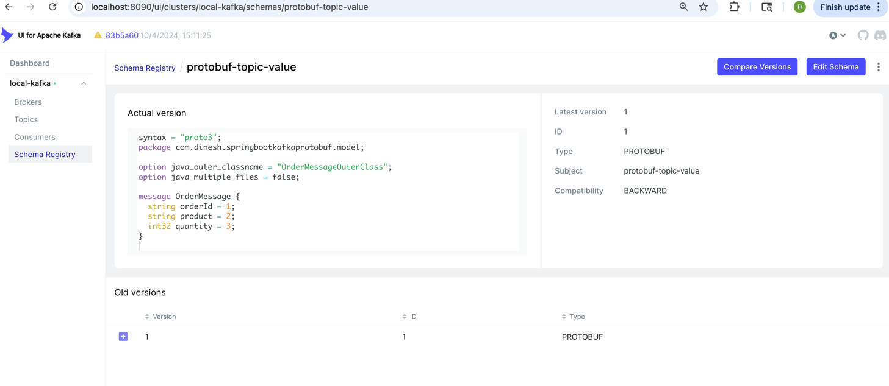

# Spring Boot Kafka Protobuf

[](https://www.oracle.com/java/)
[](https://spring.io/projects/spring-boot)
[](https://kafka.apache.org/)
[](https://protobuf.dev/)
[](https://docs.confluent.io/platform/current/schema-registry/)
[](LICENSE)

A production-ready Spring Boot example demonstrating **Apache Kafka** integration with **Google Protocol Buffers (Protobuf)** and **Confluent Schema Registry**. This project showcases how to publish and consume both **String** and **Protobuf** messages using Spring for Apache Kafka with automatic schema registration and validation.

---

## Features

- Apache Kafka Producer & Consumer
- Google Protocol Buffers Integration
- Confluent Schema Registry
- String Message Producer
- Protobuf Message Producer
- String Message Consumer
- Protobuf Message Consumer
- Automatic Schema Registration
- DTO to Protobuf Mapping
- Spring Boot REST APIs
- Docker Compose Support
- Kafka UI Integration
- Schema Registry UI
- Maven Build Support
- Production Ready Configuration

---

## Technology Stack

- Java 21
- Spring Boot
- Spring for Apache Kafka
- Apache Kafka
- Google Protocol Buffers
- Confluent Schema Registry
- Maven
- Docker
- Docker Compose
- Kafka UI

---

## Project Structure

```text
spring-boot-kafka-protobuf
│
├── docker-compose.yml
├── pom.xml
├── HELP.md
├── README.md
│
├────
│   |
│   └── screenshots
│       ├── apache-kafka-ui-dashboard.png
│       ├── apache-kafka-ui-topic-dashboard.png
│       ├── schema-registry-for-protobuff.png
|       ├── json-message-bytearray-send-receiving.png
│       └── string-message-send-receiving.png
│
├── src
│   ├── main
│   │
│   ├── java
│   │   └── com.dinesh.springbootkafkaprotobuf
│   │       ├── config
│   │       ├── consumer
│   │       ├── controller
│   │       ├── dto
│   │       ├── model
│   │       ├── producer
│   │       └── SpringBootKafkaProtobufApplication.java
│   │
│   ├── proto
│   │   └── order.proto
│   │
│   └── resources
│       └── application.properties
```

---

## Architecture

```text
                  REST Client
                       │
                       ▼
           Spring Boot Application
                       │
         ┌─────────────┴─────────────┐
         │                           │
         ▼                           ▼
  String Kafka Producer      Protobuf Kafka Producer
         │                           │
         └─────────────┬─────────────┘
                       │
                       ▼
                 Apache Kafka
                       │
                       ▼
              Schema Registry
                       │
                       ▼
          String & Protobuf Consumers
```

---

## REST APIs

| Method | Endpoint | Description |
|---------|----------|-------------|
| GET | `/?message=Hello Kafka` | Publish String Message |
| POST | `/json` | Publish Protobuf Message |

### Sample String Request

```http
GET /?message=Hello Kafka
```

### Sample Protobuf Request

```http
POST /json
Content-Type: application/json

{
  "orderId": "ORD-1001",
  "product": "Laptop",
  "quantity": 2
}
```

---

## Kafka Topics

| Topic | Description |
|---------|-------------|
| demo-topic | String Messages |
| protobuf-topic | Protobuf Messages |

---

## Protobuf Schema

The project uses Google Protocol Buffers for efficient binary serialization.

```proto
syntax = "proto3";

message OrderMessage {

    string orderId = 1;

    string product = 2;

    int32 quantity = 3;

}
```

---

# Screenshots

## Kafka UI Dashboard



---

## Kafka Topics



---


## Registered Protobuf Schema



---

## Running the Application

### Start Kafka Environment

```bash
docker compose up -d
```

### Build Project

```bash
mvn clean install
```

### Run Application

```bash
mvn spring-boot:run
```

---

## Default URLs

| Service | URL |
|----------|-----|
| Spring Boot | http://localhost:8080 |
| Kafka UI | http://localhost:8090 |
| Schema Registry | http://localhost:8081 |

---

## Repository Highlights

- Spring Boot Kafka Integration
- Google Protocol Buffers
- Schema Registry Support
- Kafka Producer
- Kafka Consumer
- REST APIs
- Docker Ready
- Kafka UI
- Schema Registry UI
- Automatic Schema Registration
- Easy to Extend
- Clean Project Structure

---

## Documentation

Additional documentation is available in the **docs** directory.

- HELP.md
- Docker Configuration
- Postman Collection
- Screenshots
- Protocol Buffer Schema

---

## Contributing

Contributions are welcome.

1. Fork the repository
2. Create your feature branch

```bash
git checkout -b feature/new-feature
```

3. Commit your changes

```bash
git commit -m "Add new feature"
```

4. Push your branch

```bash
git push origin feature/new-feature
```

5. Open a Pull Request.

---

## Contact

**Dinesh Veer**

- GitHub: https://github.com/dinesh-veer
- Email: dveer123@hotmail.com

---

## License

Distributed under the MIT License. See the `LICENSE` file for more information.

---

⭐ If you found this project useful, consider giving it a **Star** on GitHub.