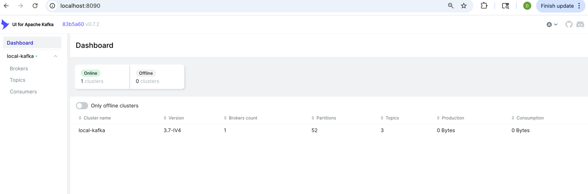
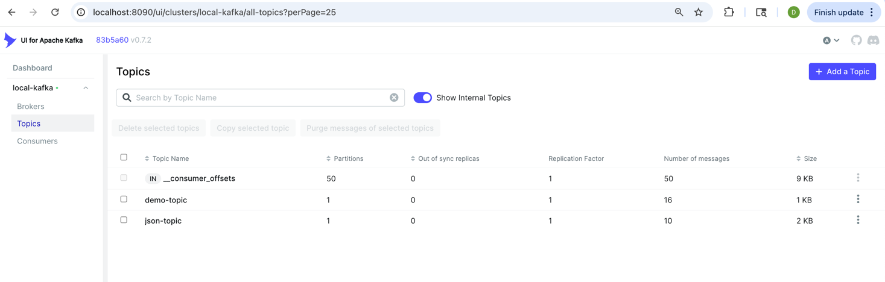
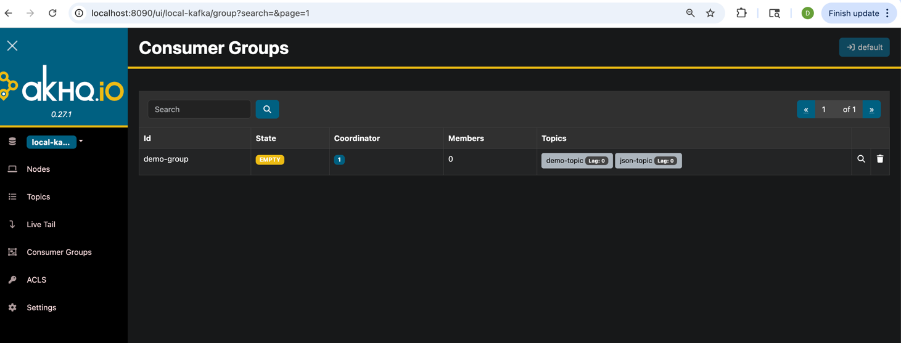
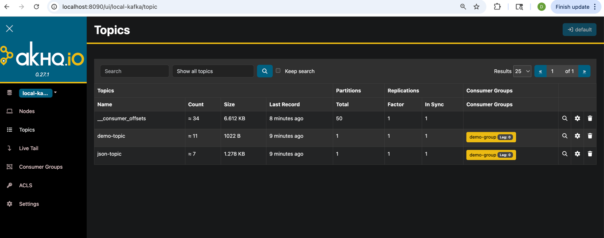
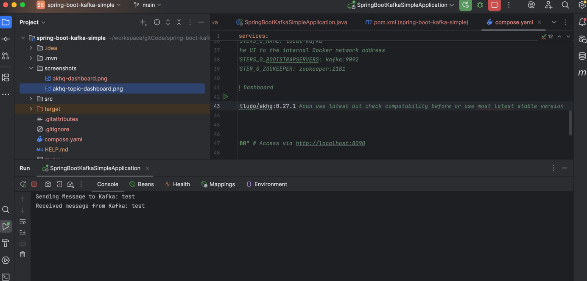
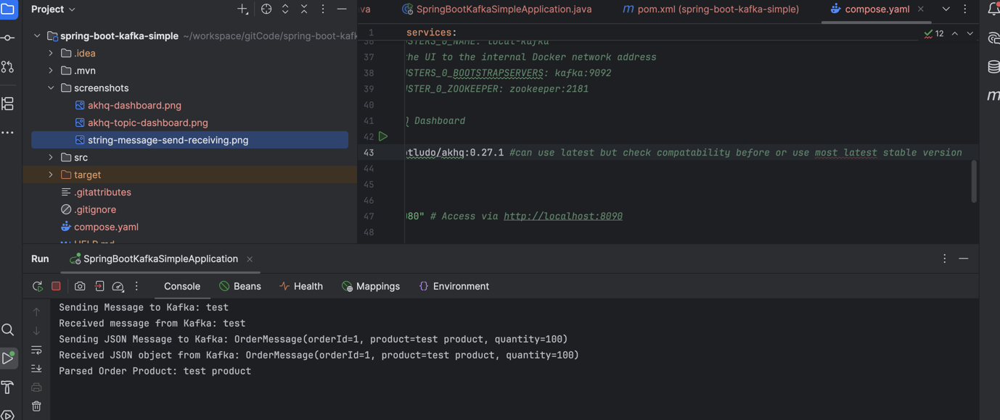

# Spring Boot Kafka Simple

<p align="center">
  
  
  
  
  
  
</p>

A simple Spring Boot application demonstrating Apache Kafka Producer and Consumer implementation for both String and JSON messages using Spring Kafka.

---

## Features

- Kafka Producer
- Kafka Consumer
- String Message Publishing
- JSON Message Publishing
- Spring Boot REST APIs
- Docker Compose Setup
- Kafka UI Dashboard
- AKHQ Dashboard
- Multiple KafkaTemplate Configuration
- Multiple Listener Container Factories
- JSON Serialization & Deserialization

---

## Tech Stack

| Technology | Version |
|------------|----------|
| Java | 21 |
| Spring Boot | 3.x |
| Spring Kafka | Latest |
| Apache Kafka | Latest |
| Docker Compose | Latest |
| Maven | Latest |

---

## Project Structure

```text
spring-boot-kafka-simple
├── screenshots
├── src/main/java
│   ├── config
│   ├── consumer
│   ├── controller
│   ├── model
│   └── producer
├── src/main/resources
├── compose.yaml
├── pom.xml
└── HELP.md
````

---

## Kafka Topics

| Topic      | Payload Type |
| ---------- | ------------ |
| demo-topic | String       |
| json-topic | OrderMessage |

---

## OrderMessage Model

```java
@Data
@NoArgsConstructor
@AllArgsConstructor
public class OrderMessage {

    private String orderId;
    private String product;
    private int quantity;
}
```

### Sample JSON Payload

```json
{
  "orderId": "ORD-1001",
  "product": "Laptop",
  "quantity": 2
}
```

---

## REST APIs

### Send String Message

#### Endpoint

```http
GET /
```

#### Example

```bash
curl "http://localhost:8080/?message=Hello Kafka"
```

#### Response

```text
Successfully sent message to Kafka: Hello Kafka
```

---

### Send JSON Message

#### Endpoint

```http
POST /json
```

#### Request Body

```json
{
  "orderId": "ORD-1001",
  "product": "Laptop",
  "quantity": 2
}
```

#### Example

```bash
curl --location 'http://localhost:8080/json' \
--header 'Content-Type: application/json' \
--data '{
  "orderId": "ORD-1001",
  "product": "Laptop",
  "quantity": 2
}'
```

#### Response

```text
Message sent : OrderMessage(orderId=ORD-1001, product=Laptop, quantity=2)
```

---

## Kafka Message Flow

### String Message Flow

```text
Client
   |
   v
GET /?message=Hello Kafka
   |
   v
KafkaProducer
   |
   v
demo-topic
   |
   v
KafkaConsumer.consume()
```

### JSON Message Flow

```text
Client
   |
   v
POST /json
   |
   v
KafkaProducer
   |
   v
json-topic
   |
   v
KafkaConsumer.consumeJson()
```

---

## Running Kafka Using Docker

Start services:

```bash
docker compose up -d
```

Stop services:

```bash
docker compose down
```

Check running containers:

```bash
docker ps
```

---

## Build Project

```bash
mvn clean install
```

---

## Run Application

```bash
mvn spring-boot:run
```

or

```bash
java -jar target/spring-boot-kafka-simple.jar
```

---

## Testing

### String Message

```bash
curl "http://localhost:8080/?message=Hello Kafka"
```

### JSON Message

```bash
curl --location 'http://localhost:8080/json' \
--header 'Content-Type: application/json' \
--data '{
  "orderId": "ORD-1001",
  "product": "Laptop",
  "quantity": 2
}'
```

---

## Sample Logs

### String Message

Producer

```text
Sending Message to Kafka: Hello Kafka
```

Consumer

```text
Received message from Kafka: Hello Kafka
```

### JSON Message

Producer

```text
Sending JSON Message to Kafka:
OrderMessage(orderId=ORD-1001, product=Laptop, quantity=2)
```

Consumer

```text
Received JSON object from Kafka:
OrderMessage(orderId=ORD-1001, product=Laptop, quantity=2)

Parsed Order Product: Laptop
```

---

## Screenshots

### Kafka UI Dashboard



### Kafka UI Topic Dashboard



### AKHQ Dashboard



### AKHQ Topic Dashboard



### String Message Send & Receive



### JSON Message Send & Receive



---

## Future Enhancements

* Kafka Protobuf Integration
* Kafka Avro Integration
* Schema Registry
* Retry Mechanism
* Dead Letter Queue (DLQ)
* Kafka Streams
* Batch Consumers
* Manual Acknowledgement
* Transactional Messaging

---

## Contributing

Contributions are welcome!

1. Fork the repository
2. Create a feature branch

```bash
git checkout -b feature/my-feature
```

3. Commit your changes

```bash
git commit -m "Add new feature"
```

4. Push to GitHub

```bash
git push origin feature/my-feature
```

5. Create a Pull Request

---

## Support

If you found this project useful:

⭐ Star the repository

🐛 Report issues

💡 Suggest improvements

---

## Contact

### Dinesh Veer

GitHub: [https://github.com/dinesh-veer](https://github.com/dinesh-veer)

Repository:

[https://github.com/dinesh-veer/spring-boot-kafka](https://github.com/dinesh-veer/spring-boot-kafka)

---

## License

This project is licensed under the MIT License.

```